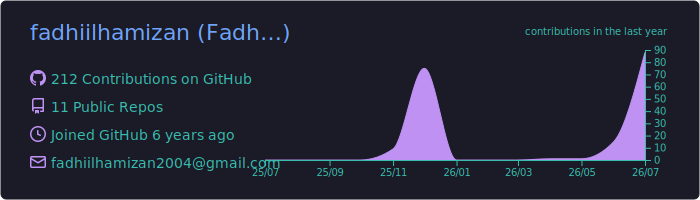
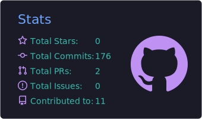

<h1 align="center">Hi, I'm Fadhiil 👋</h1>

  <i>Information Systems student at ITS, building things one project at a time.</i>

  

  
  
  

---

### 🌱 A bit about me

I'm currently studying Information Systems at Institut Teknologi Sepuluh Nopember (ITS), Surabaya. Most of my time goes into building web projects, tinkering with game ideas, and occasionally helping run events through student organizations on campus.

I like turning small, everyday problems into working apps. Bookuy started because I got tired of seeing classmates struggle to trade secondhand textbooks. Momentum came from wanting a task manager that actually helps me stay consistent instead of just listing chores. That's usually how my projects start: a problem I've noticed, then a lot of trial and error until something works.

Outside of code, I spend time with game development, since I like building experiences almost as much as I like building software.

### 🛠️ What I work with

  

### 🚀 Projects I'm proud of

<table>
  <tr>
    <td width="33%" valign="top">
      <b>🌤️ weather-dashboard</b> 
      A fast, full-stack weather dashboard built around a backend proxy, response caching, and a UI whose sky changes to match the forecast. Search any city (or use your location) and get current conditions at a glance.
    </td>
    <td width="33%" valign="top">
      <b>🚀 Momentum</b> 
      A premium task management desktop application designed to help you build consistent daily momentum, stay focused, and achieve your long-term goals seamlessly.
    </td>
    <td width="33%" valign="top">
      <b>📚 Bookuy</b> 
      An eco-friendly, cost-effective academic marketplace that bridges the gap between students who have unused books and those who need them.
    </td>
  </tr>
</table>

### 📊 GitHub stats

  

  

  

### 💬 Let's talk

I'm always up for a conversation about web development, game design, or campus tech events. Feel free to reach out through LinkedIn or email, I usually reply within a day or two.

  <i>Thanks for stopping by. Feel free to explore my pinned repos below 👇</i>

